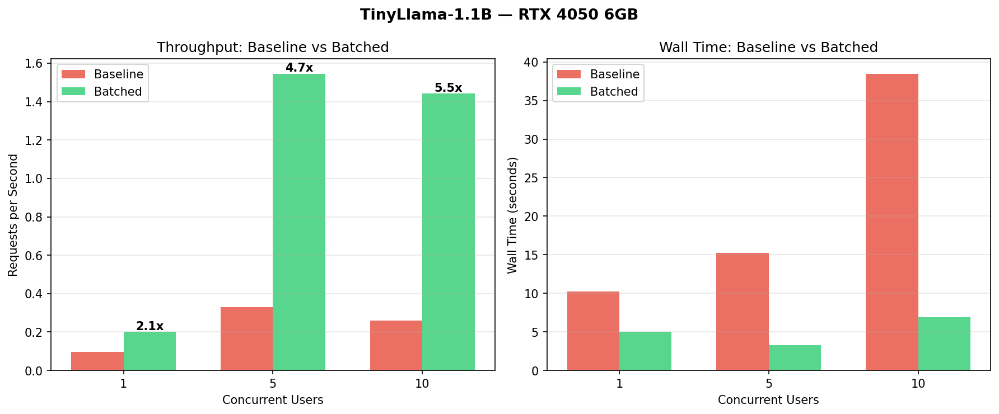

# KV Server

Minimal local chat app with:

- **Backend**: FastAPI + Transformers stream generation
- **Frontend**: React + Vite UI that consumes SSE

## Project Structure

- `main.py` — FastAPI app and `/generate` SSE endpoint
- `frontend/` — React client
- `docs/ARCHITECTURE.md` — component and data-flow overview
- `benchmarks/` — benchmark scripts and outputs

## Quick Start

### 1) Backend

From project root:

```bash
python3 main.py
```

If you run with uvicorn explicitly:

```bash
uvicorn main:app --reload --host 0.0.0.0 --port 8000
```

### 2) Frontend

From `frontend/`:

```bash
npm install
npm run dev
```

Open `http://localhost:5173`.

## API (Current)

### `POST /generate`

Request body:

```json
{ "question": "What is the meaning of life?" }
```

Response:

- `Content-Type: text/event-stream`
- SSE chunks with `data: <token>`
- terminal marker: `data: [DONE]`

## Notes

- CORS currently allows local frontend origins.
- Model is loaded once at startup in `main.py`.
- This README is intentionally a skeleton; extend with deployment and env setup as needed.

## Benchmarks



Benchmark details and raw outputs live in [benchmarks/baseline.md](benchmarks/baseline.md).

Run the baseline benchmark:

```bash
python benchmarks/baseline_benchmark.py
```

Run locust:

```bash
locust -f benchmarks/locustfile.py
```

Regenerate the plot:

```bash
python benchmarks/plot_benchmarks.py
```
