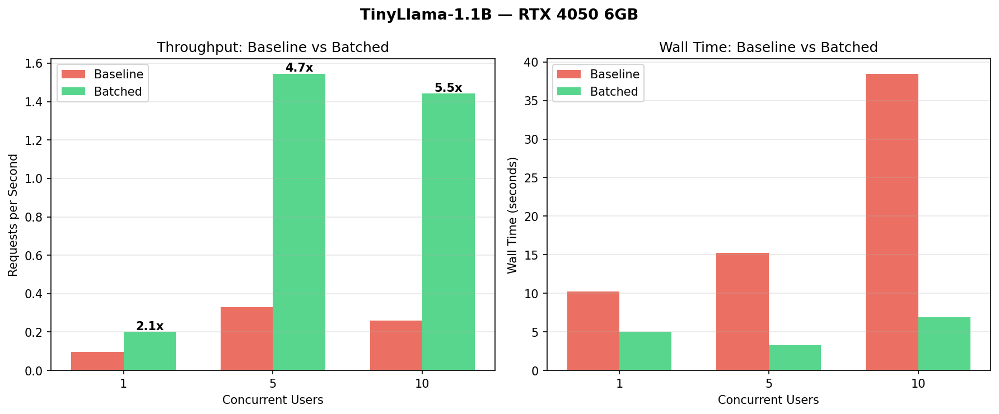

# LLM Inference Server

A production-grade LLM inference server built from scratch,
implementing continuous batching, KV cache tracking, request
queuing, and SSE token streaming.

Built to understand the systems challenges in production model
serving — the same problems vLLM, Ollama, and TGI solve at scale.

---

## Demo

[insert GIF of streaming response here]

---

## Benchmark Results

**5.5x throughput improvement** through continuous batching
on TinyLlama-1.1B, RTX 4050 6GB.

| Users | Baseline RPS | Batched RPS | Improvement |
|-------|-------------|-------------|-------------|
| 1     | 0.097       | 0.201       | 2.1x        |
| 5     | 0.329       | 1.546       | 4.7x        |
| 10    | 0.260       | 1.442       | 5.5x        |

Wall time for 10 concurrent users: **38.5s → 6.9s**



These numbers are from the earlier window batch (collect, then one
`pipeline()` call). See `benchmarks/baseline.md`. They have not been
re-run on the prefill/decode loop described below.

---

## Architecture

```
POST /generate
      │
      ▼
FastAPI + asyncio
      │
      ▼
Request Queue (asyncio.Queue)
Backpressure: 503 if depth > 20
Timeout: 408 if waiting > 30s
      │
      ▼
Batch Scheduler
Waits 50ms or until batch_size=8
      │
      ▼
GPU Forward Pass (ThreadPoolExecutor)
TinyLlama-1.1B via HuggingFace
Processes the current batch together
      │
      ▼
SSE Token Stream
Each request has isolated result_queue
Tokens streamed via Server-Sent Events
```

Since the step loop, the scheduler is not sealed for the whole
generation. When the GPU is idle it still waits 50ms and stops at 8.
While requests are already decoding, it takes anyone waiting if a
seat is free, prefills them, and includes them on the next token.
503 is returned when the queue depth is already 20. Each request
streams token text as it is decoded, then `data: [DONE]`.

---

## Key Design Decisions

**Why continuous batching?**
Sequential processing leaves the GPU idle between requests.
Batching amortizes the fixed overhead (kernel launch, memory
allocation) across multiple sequences, keeping GPU utilization
high. Measured 5.5x throughput improvement on this hardware.

The current loop admits new requests between tokens, instead of
holding the batch closed until `pipeline()` returned. A new arrival
can join a batch that is already generating, up to 8 sequences.

**Why asyncio.Queue for request management?**
Decouples HTTP handling from GPU execution. FastAPI accepts
new connections while the GPU is busy, rather than blocking
the entire server on each generation. The queue also enables
backpressure — reject requests gracefully when overloaded
rather than accepting unbounded load.

Each request also has a private `result_queue`. The shared queue
is only the waiting room. One client never receives another
client's tokens.

**Why ThreadPoolExecutor for generation?**
The model forward is synchronous. Running it directly in
an async context would block the event loop, preventing FastAPI
from handling other requests. The executor runs prefill and
each decode step in a thread while the event loop stays free.

**Why call_soon_threadsafe for token routing?**
Bridges the sync executor thread back to the async event loop
safely. Directly calling async functions from threads causes
race conditions. call_soon_threadsafe queues the callback on
the event loop from the thread safely.

**What would I do differently at scale?**
Implement PagedAttention. My KV cache allocates contiguously —
under mixed-length workloads this causes fragmentation where
GPU memory appears full but is actually wasted. PagedAttention
treats GPU memory like OS virtual memory with fixed-size pages,
eliminating fragmentation and enabling much higher utilization.
This is vLLM's core contribution.

The step loop still left-pads shorter KV caches up to the longest
sequence in the batch, masks that padding, then slices it off.
`/metrics` still estimates KV (active requests × 100 tokens). It
does not count the real bytes in each request's cache.

---

## Endpoints

| Method | Path | Description |
|--------|------|-------------|
| POST | /generate | Generate text, SSE streaming |
| GET | /metrics | Real-time server stats + KV cache |
| GET | / | Health check |

### /metrics response
```json
{
  "server": {
    "active_requests": 5,
    "queue_depth": 3,
    "queue_utilization_pct": 15.0,
    "total_requests_processed": 247,
    "total_tokens_generated": 45821,
    "last_batch_time_s": 3.421
  },
  "kv_cache": {
    "estimated_kv_mb": 88.0,
    "gpu_used_mb": 2106,
    "gpu_free_mb": 3665,
    "gpu_utilisation_percent": 36.5
  }
}
```

---

## Run Locally

```bash
# clone
git clone https://github.com/AST0008/kv_server
cd kv_server

# install
pip install -r requirements.txt

# run
uvicorn main:app --reload

# test
curl -N -X POST http://localhost:8000/generate \
  -H "Content-Type: application/json" \
  -d '{"question": "What is machine learning?"}'

# metrics
curl http://localhost:8000/metrics
```

## Run with Docker

```bash
docker build -t inference-server .
docker run -p 8000:8000 --gpus all inference-server
```

---

## What I Learned

Building this taught me why vLLM exists. The naive sequential
approach is easy to implement but collapses under load — 10
concurrent users means the last one waits 38 seconds. Every
component here (the queue, the batch scheduler, the executor
bridge, the KV cache tracking) exists to solve a specific,
real problem I encountered while building.

The gap between my implementation and vLLM is primarily
PagedAttention — my contiguous KV cache allocation causes
fragmentation under mixed-length workloads. Understanding
exactly why that's a problem, and what the solution looks
like, is what this project was built to teach.

The later step loop is the continuous-batching piece: membership
can change between tokens, and tokens go out while the GPU is
still decoding. PagedAttention is still the open gap.

---

## References

- [Orca: Continuous Batching](https://www.usenix.org/conference/osdi22/presentation/yu)
- [vLLM: PagedAttention](https://arxiv.org/abs/2309.06180)
- [Anyscale: Continuous Batching Explainer](https://www.anyscale.com/blog/continuous-batching-llm-inference)
- [Karpathy: Build GPT from Scratch](https://www.youtube.com/watch?v=kCc8FmEb1nY)
