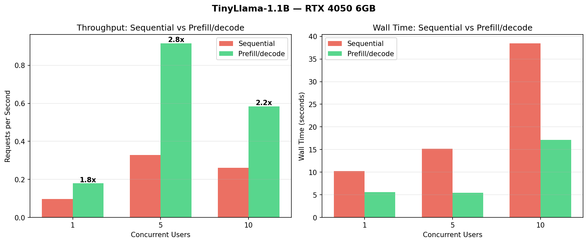

# LLM Inference Server

A TinyLlama inference server with a prefill/decode loop, 16-token paged KV
block pool, continuous batching, and SSE token streaming.

Built to understand the systems challenges in production model serving —
the same problems vLLM, Ollama, and TGI solve at scale.

---

## Demo

[insert GIF of streaming response here]

---

## Benchmark Results

Same prompt ("What is Artificial Intelligence?"), TinyLlama-1.1B, RTX 4050 6GB.

Sequential baseline: one request at a time, no batching (`benchmarks/baseline.md`,
2026-04-20). Prefill/decode column: this server, pages + admit-between-tokens,
batch cap 8.

| Users | Sequential RPS | Prefill/decode RPS | Improvement |
| ----- | -------------- | ------------------ | ----------- |
| 1     | 0.097          | 0.179              | 1.8x        |
| 5     | 0.329          | 0.916              | 2.8x        |
| 10    | 0.260          | 0.584              | 2.2x        |

Wall time for 10 concurrent users: **38.5s → 17.1s**

An earlier window-batch run (one `pipeline()` call per batch, ~64-word
completions) reached 1.442 RPS at 10 users. That RPS is not comparable to
the table above because the completions were shorter (~64 words vs ~194 words
here). Both sets of raw numbers are in `benchmarks/`.



---

## Architecture

```
POST /generate
      │
      ▼
reserve()
Allocate KV pages for the prompt tokens from the page pool.
503 before any SSE byte if the free list cannot cover the prompt.
503 if queue depth is already at 20 (pages released immediately).
      │
      ▼
uuid request_id + private result_queue
X-Request-Id response header
SSE comment: ": request <id>"
      │
      ▼
Batch Scheduler
GPU idle:         wait up to 50ms, admit up to 8
Already decoding: admit any waiting request if a seat is free (no wait)
      │
      ▼
Prefill  (ThreadPoolExecutor)
Tokenize batch → one forward pass → write KV into pages
Emit first token per request via call_soon_threadsafe
      │
      ▼
Decode loop  (ThreadPoolExecutor)
For each step:
  gather() pages → one contiguous cache per request
  Left-pad to longest sequence, mask padding
  One batched forward pass
  write() only the new token back to pages
  Emit token per request via call_soon_threadsafe
  admit() any waiting request between steps (up to batch cap)
Repeat until EOS or MAX_NEW_TOKENS per request
      │
      ▼
SSE token stream → data: [DONE]
408 if any token wait exceeds 30s
```

---

## Key Design Decisions

**Why continuous batching?**
Sequential processing leaves the GPU idle between requests. Batching
amortizes fixed overhead (kernel launch, memory allocation) across multiple
sequences, keeping GPU utilization high. On this hardware the prefill/decode
loop measured 2.2x at 10 users vs the sequential baseline (0.260 → 0.584 RPS;
wall time 38.5s → 17.1s).

The scheduler is not sealed for the whole generation. While requests are
already decoding, any waiting request can join the batch at the next token
step — up to 8 sequences. A new arrival does not wait for the current batch
to finish before it starts generating.

**Why asyncio.Queue for request management?**
Decouples HTTP handling from GPU execution. FastAPI accepts new connections
while the GPU is busy rather than blocking on each generation. The queue
enables backpressure — reject gracefully when overloaded rather than
accepting unbounded load.

Each request has a private `result_queue`. The shared queue is only the
waiting room. One client never receives another client's tokens.

**Why ThreadPoolExecutor for generation?**
The model forward pass is synchronous. Running it directly in an async
context blocks the event loop, preventing FastAPI from handling other
requests. The executor runs both prefill and each decode step in a thread
while the event loop stays free to accept new connections.

**Why call_soon_threadsafe for token routing?**
`asyncio.Queue` is not thread-safe. The decode loop runs in a ThreadPoolExecutor
thread; calling `await queue.put()` from that thread causes race conditions.
`call_soon_threadsafe` schedules `put_nowait` on the event loop from the thread
safely — the event loop processes it in order from its own thread.

**Paged KV pool**
The server owns all KV memory as fixed 16-token blocks (`kv_pages.py`).
Each request holds a block table — a list of physical page ids. When a
request finishes, its page ids go back on the free list and are immediately
reusable by the next request, even if they are not contiguous in memory.

The pool is sized at 40% of free GPU memory after the weights load.
`KV_NUM_BLOCKS` overrides that. `reserve()` runs the admission check before
the request enters the queue: if the free list cannot cover the prompt tokens,
the request is rejected with 503 before any SSE byte is written.

**What is still missing vs vLLM**
The memory model here matches PagedAttention: fixed-size blocks, per-request
block tables, just-in-time allocation, and free-list reuse. The remaining gap
is the attention kernel.

Each decode step still `gather()`s the page contents into one contiguous
cache, runs ordinary HuggingFace attention over it, then `write()`s only the
new token back. vLLM's PagedAttention kernel reads the block table directly
during attention and eliminates that copy entirely. That kernel requires
custom CUDA — it is the one piece not in this repo.

---

## Endpoints

| Method | Path      | Description                      |
| ------ | --------- | -------------------------------- |
| POST   | /generate | Generate text, SSE streaming     |
| GET    | /metrics  | Real-time server + KV pool stats |
| GET    | /         | Health check                     |

### /metrics response

All KV numbers come from `PagePool.stats()` — real block counts, not estimates.
`num_blocks` depends on free GPU memory at load time (or `KV_NUM_BLOCKS`).
Numbers below are from an example run, not a fixed value.

```json
{
  "server": {
    "active_requests": 1,
    "queue_depth": 0,
    "queue_capacity": 20,
    "queue_utilization_pct": 0.0,
    "current_batch_size": 1,
    "total_requests_processed": 47,
    "total_tokens_generated": 9134,
    "last_batch_time_s": 3.421
  },
  "kv_cache": {
    "block_size": 16,
    "num_blocks": 128,
    "free_blocks": 120,
    "used_blocks": 8,
    "filled_tokens": 40,
    "bytes_per_block": 360448,
    "bytes_per_token": 22528,
    "kv_bytes": 2883584,
    "kv_mb": 2.75,
    "gpu_total_mb": 6144,
    "gpu_used_mb": 2300,
    "gpu_free_mb": 3844,
    "gpu_utilisation_percent": 37.43
  },
  "config": {
    "batch_size": 8,
    "batch_wait_ms": 50.0,
    "kv_block_size": 16,
    "kv_num_blocks": 128,
    "max_queue_depth": 20,
    "request_timeout_s": 30,
    "max_new_tokens": 200,
    "model": "TinyLlama-1.1B-Chat-v1.0"
  }
}
```

---

## Run Locally

```bash
# clone
git clone https://github.com/AST0008/kv_server
cd kv_server

# install
pip install -r requirements.txt

# run
uvicorn main:app --reload

# test
curl -N -X POST http://localhost:8000/generate \
  -H "Content-Type: application/json" \
  -d '{"question": "What is machine learning?"}'

# metrics
curl http://localhost:8000/metrics
```

## Run with Docker

```bash
docker build -t inference-server .
docker run -p 8000:8000 --gpus all inference-server
```

---

## What I Learned

Building this taught me why vLLM exists. The naive sequential approach
collapses under load — 10 concurrent users means the last one waits 38
seconds. Every component here exists to solve a specific problem I hit
while building:

The **request queue** decouples HTTP from GPU execution so FastAPI stays
responsive while the model is running. The **batch scheduler** keeps the
GPU busy across concurrent requests. The **executor bridge** solves the
async/sync boundary — `call_soon_threadsafe` is the piece that routes tokens
from a sync thread back to async SSE streams without race conditions. The
**page pool** is the memory model: instead of reserving worst-case memory
upfront per request, 16-token blocks are allocated just-in-time and freed
immediately on completion.

The remaining gap to vLLM is the attention kernel. Every decode step still
copies page contents into a contiguous cache before attention. vLLM's kernel
reads the block table directly and skips that copy. That one change is what
makes PagedAttention a research contribution rather than just an engineering
choice — and it is what this project is missing.

---

## References

- [Orca: Continuous Batching](https://www.usenix.org/conference/osdi22/presentation/yu)
- [vLLM: PagedAttention](https://arxiv.org/abs/2309.06180)
- [Anyscale: Continuous Batching Explainer](https://www.anyscale.com/blog/continuous-batching-llm-inference)
- [Karpathy: Build GPT from Scratch](https://www.youtube.com/watch?v=kCc8FmEb1nY)
